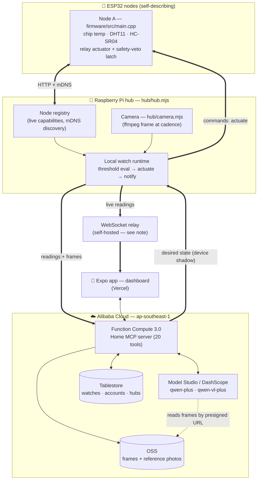

# 🏡 Hearth

**Describe your home in plain words. It figures out the rest.**

> **Global AI Hackathon Series with Qwen Cloud — Track 5: EdgeAgent**
> Live on Alibaba Cloud · MIT licensed · [github.com/mattrickslauer/hearth](https://github.com/mattrickslauer/hearth)

Hearth is a home-automation platform where you don't write rules — you *say what you want*, and
Qwen compiles it into a running deployment on real hardware. Plug in a $5 ESP32, tell it *"if the
nursery goes over 78, cut the heater and text me"*, and Hearth wires the sensors, the logic, and
the actions for you.

---

## ✅ Proof of Alibaba Cloud deployment (live right now)

The backend runs on **Alibaba Function Compute 3.0** in `ap-southeast-1`. Check it yourself:

```bash
curl https://hearth-mcp-gqfuhlkzpo.ap-southeast-1.fcapp.run/health
```
```json
{"ok":true,"service":"hearth-cloud","brain":"qwen","store":"tablestore","tools":20}
```

That one response is the whole cloud stack, live: `brain:"qwen"` = a real DashScope key serving
Qwen; `store:"tablestore"` = Alibaba Tablestore holding the data plane; `tools:20` = the Home MCP
surface Qwen calls. The host resolves to `47.236.86.78` — **Alibaba Cloud LLC**.

| Alibaba service | What it does here | Where |
|---|---|---|
| **Function Compute 3.0** | The whole backend: Home MCP server + Qwen orchestration. Custom `debian10` runtime, scale-to-zero. | [`backend/s.yaml`](backend/s.yaml) |
| **Model Studio / DashScope — Qwen** | `qwen-plus` authors deployments; `qwen-vl-plus` reads camera frames. | [`backend/src/qwen.ts`](backend/src/qwen.ts) |
| **Tablestore** | Durable watches, accounts, OTP, hub pairings, device registry. Tables auto-create. | [`backend/src/tablestore.ts`](backend/src/tablestore.ts) |
| **OSS** | Camera frames + household reference photos Qwen-VL reads, served by presigned URL. Bucket `hearth-vision-c11d45`. | [`backend/src/oss.ts`](backend/src/oss.ts) |

Verify the AI end-to-end against the live API — these exit non-zero if it isn't really Qwen:

```bash
cd backend && npm run qwen-check && npm run qwen-vl-check
```

## The one-paragraph pitch

Home automation makes you *program* it — rules, thresholds, YAML, IFTTT chains. That's why almost
nobody automates anything. Hearth replaces the rules with an agent. A cheap kit of ESP32 nodes
self-describes what it can sense and do; a Raspberry Pi hub orchestrates them; and **Qwen Cloud**
does the two things no rule engine can: it **turns your intent into a working deployment**, and it
**reasons about ambiguous situations at runtime** (including *seeing*, via Qwen-VL).

## Why this isn't Home Assistant

> *Would this be meaningfully worse if we deleted Qwen and dropped in a 50-line script?*

For a rule engine, no. For Hearth, **emphatically yes** — Qwen is load-bearing in two places a
script can't touch:

**1. Authoring — natural language → a real deployment (program synthesis).**
You say *"warn me if the garage is left open after dark."* Qwen sees the live node registry (what
sensors exist, what they can do) and **synthesizes the deployment**: which sensors to bind, the
trigger predicate, the action. *You never wrote a rule.* → [`backend/src/qwen.ts`](backend/src/qwen.ts) `author()`

**2. Runtime — reasoning about the messy real world.**
Qwen-VL looks at an actual frame and judges the situation — *is this person a household member?* —
by comparing against reference photos you uploaded. Open-vocabulary perception, no face-embedding
model, no local threshold can do it. → [`backend/src/qwen.ts`](backend/src/qwen.ts) `judge()`

**Deliberately token-frugal:** Qwen compiles most wishes down to a **local predicate** that runs on
the hub for free, forever, offline. The model is invoked only where open-ended reasoning is
genuinely needed. That's the point of compiling questions rather than streaming everything to a model.

## Architecture (as shipped)



| Tier | Hardware | Job |
|---|---|---|
| **Nodes** | ESP32 + sensors/actuators | Self-describe capabilities, stream readings at a tunable cadence, execute commands, **autonomous safety veto** |
| **Hub** | Raspberry Pi (+ USB webcam) | Node registry, run compiled local watches, actuate, push notifications, sync to cloud |
| **Cloud** | **Alibaba Function Compute + Qwen** | **Authoring** (NL→config) + **Qwen-VL runtime reasoning** + durable state |

**Note on the relay:** live dashboard readings ride a small self-hosted WebSocket relay
([`relay/relay.mjs`](relay/relay.mjs)) rather than an Alibaba service, because Function Compute
can't hold an open browser WebSocket. Rationale in [`backend/docs/realtime-relay.md`](backend/docs/realtime-relay.md).
The dashboard itself is on Vercel; **the backend, the brain, and all state are on Alibaba Cloud.**

## What's real — and what isn't

We'd rather be checkable than impressive. Everything below is grep-able.

**Real on hardware:**
- **ESP32 firmware** ([`firmware/src/main.cpp`](firmware/src/main.cpp)) — real `temperatureRead()`, real HC-SR04 pulse timing, DHT11, per-sensor cadence timers, mDNS hub discovery + re-discovery after 3 failed posts, self-describing `DESCRIBE` document, and a **safety-veto latch** that ignores an "on" command it considers unsafe *no matter which side issued it* (`:371-375`).
- **The hub** ([`hub/hub.mjs`](hub/hub.mjs), 615 lines) — real ingest, LRU-bounded registry, constant-time token check, body caps, adaptive sync debounce, exponential backoff with a 60s ceiling, and 401/403-vs-transient handling so a network blip doesn't wipe hub identity.
- **The loop that fires on camera:** sensor → hub threshold eval → **real HTTP actuate on the ESP32** → **real phone push** (ntfy/Telegram). Warm the board with your hand and the relay clicks.
- **Cadence downlink** — per-sensor sample rate (0.5s–60s) set from the dashboard, riding the ingest reply so nodes need no server.
- **Camera** ([`hub/camera.mjs`](hub/camera.mjs)) — real ffmpeg capture, JPEG EOI-marker aware, registered as an ordinary node.
- **Device shadow** — `actuate` MCP tool → desired state → hub downlink → firmware. Real, DIY (not Alibaba IoT Platform).
- **Authoring reaches the hardware.** A watch you describe in the app is compiled by Qwen, stored in Tablestore, and adopted by the hub on its next device sync — which is debounced onto live readings, so it's running on your ESP32 about a second later. No copy-paste, no restart. Deleting or re-compiling it in the app propagates the same way, and the hub caches the set to disk so a reboot with no internet keeps running it. → [`hub/runtime.mjs`](hub/runtime.mjs) `setWatches`, [`backend/src/hub-devices.ts`](backend/src/hub-devices.ts) `hubWatches`

**Honest gaps (v1):**
- **The hub does not call Qwen.** It runs *compiled local predicates* — which is the design (they're free and work offline) — but cloud/vision watches are evaluated app-side, not on the hub ([`hub/runtime.mjs`](hub/runtime.mjs)).
- **No privacy filter yet.** The `transform: raw|crop|downscale|redact` policy field is stored but **not enforced** — full frames go to OSS. What's real is *architectural*: frames are **sampled, not streamed**, at a cadence you control, and presigned URLs expire. Don't read more into it than that.
- **No hub-side offline buffer.** Local watches keep firing with no internet (the important half), but readings during an outage are not queued and replayed.
- **`/demo` is a simulator.** The browser demo is a hardcoded world; its judge path is text-only `qwen-plus`, not Qwen-VL. The **dashboard** is the real thing.

## How it maps to the Track 5 rubric

| Rubric asks for… | Hearth delivers |
|---|---|
| perceive via edge sensors | Self-describing ESP32 nodes (chip temp, DHT11, HC-SR04) + hub webcam |
| reason via cloud APIs / Skills | Qwen authors deployments (`qwen-plus`) and judges frames (`qwen-vl-plus`) through a **20-tool Home MCP surface** on Function Compute |
| act locally | Real relay/servo actuation over HTTP + device-shadow downlink; **autonomous node-side safety veto** |
| orchestration under bandwidth/latency | Sampled-not-streamed frames, per-sensor cadence downlink, adaptive debounce, exponential backoff, mDNS re-discovery |
| graceful degradation offline | Compiled **local** watches need zero cloud — they fire during an outage; nodes re-find a restarted hub; the veto is autonomous *(no event buffering yet — see gaps)* |
| privacy-aware data handling | Local-first by design: most watches never leave the house; frames sampled on cadence; presigned expiring URLs *(no redaction filter yet — see gaps)* |

## Try it

**Fastest — no hardware, no clone:** hit the live Alibaba backend.
```bash
curl https://hearth-mcp-gqfuhlkzpo.ap-southeast-1.fcapp.run/health
```

**The app** (Expo — React Native + web):
```bash
cd frontend && npm install && npm run web    # or: npm run ios / npm run android
```
`/demo` — the browser simulator: describe a watch, then poke the world (day↔night, open the garage,
drop the temp, kill the network). `/dashboard` — the real thing: sign in, pair a hub, live sensors.

**Real hardware** — flash a node and run the hub: [`firmware/README.md`](firmware/README.md) · [`hub/README.md`](hub/README.md)

**Deploy your own cloud** to Alibaba Function Compute: [`backend/README.md`](backend/README.md)

## Hardware (the reference kit)

Raspberry Pi hub (+ USB webcam) · ESP32-WROOM-32 nodes · DHT11 temp/humidity · HC-SR04 distance
(door/presence) · relay (heater/light) · servo (pan/blinds) · I²C 16×2 LCD · solar panel (off-grid
outdoor node). A node is **~$5 of chip**. Full list: [`INVENTORY.md`](INVENTORY.md).

## Ethics & privacy

A home camera is highly sensitive. Hearth is **local-first** — compiled local watches never contact
the cloud at all — but read the honest gaps above: there is **no redaction filter in v1**, and
frames sent to Qwen-VL are full frames in OSS. Hearth *assists*; it is not a security or safety
guarantee.

## Docs

[`docs/00-capabilities.md`](docs/00-capabilities.md) capabilities · [`docs/01-infra-alibaba-cloud.md`](docs/01-infra-alibaba-cloud.md) infra ·
[`docs/02-data-model.md`](docs/02-data-model.md) data model · [`docs/03-agent-mcp-surface.md`](docs/03-agent-mcp-surface.md) MCP surface ·
[`docs/04-rule-engine.md`](docs/04-rule-engine.md) question compilation · [`docs/05-ux.md`](docs/05-ux.md) UX ·
[`docs/06-video-script.md`](docs/06-video-script.md) demo script

> These are **design docs written during the build** — where one disagrees with the code, the code
> and this README are the truth.

## License

[MIT](LICENSE) © 2026 Hearth contributors.
