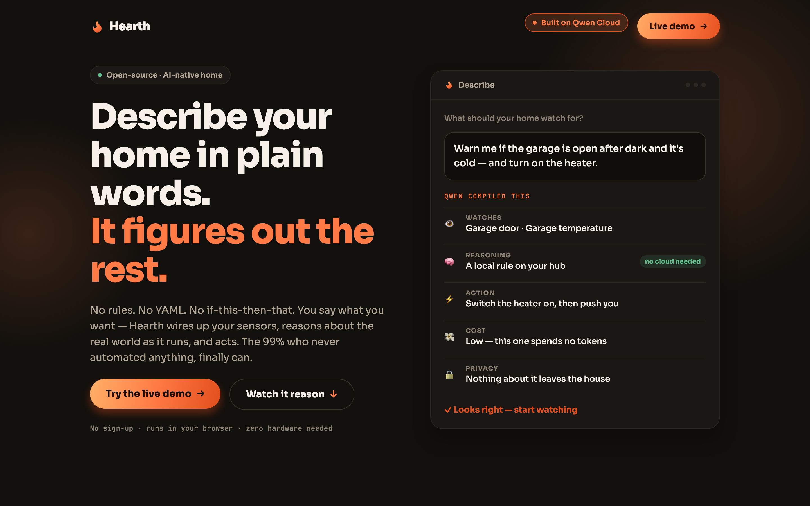
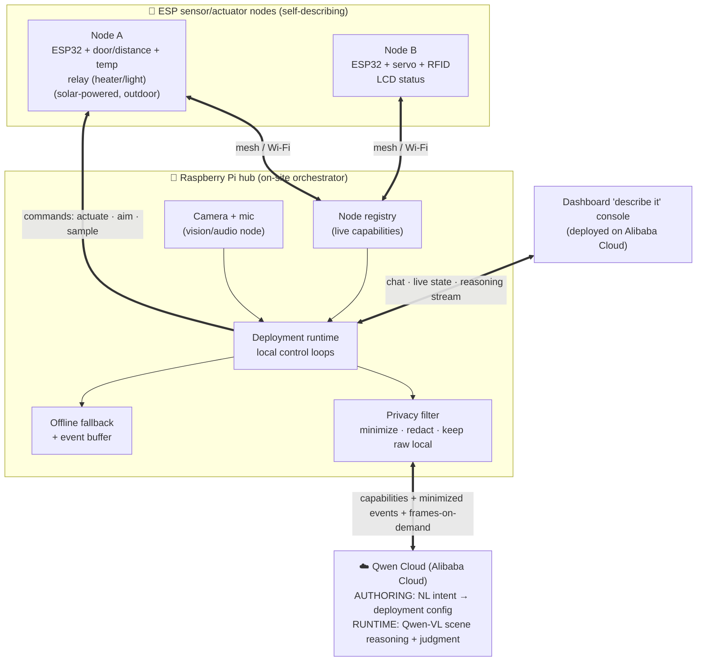

# 🏡 Hearth

**Describe your home in plain words. It figures out the rest.**



Hearth is a home automation platform where you don't write rules — you *say what you want*,
and an LLM agent configures your sensor nodes and reasons about live data to make it happen.
Plug in a node, tell it *"warn me if the garage is open after dark and it's cold, and turn on
the heater,"* and Hearth wires the sensors, the logic, and the actions for you — then reasons
about the real world as it runs.

> **Global AI Hackathon Series with Qwen Cloud — Track 5: EdgeAgent**
> *(Hearth is a working name — trivially renamed.)*

---

## The one-paragraph pitch

Home automation today makes you *program* it — rules, thresholds, YAML, IFTTT chains. That's
why 99% of people never automate anything. Hearth replaces the rules with an agent. A cheap
kit of ESP sensor/actuator nodes self-describes what it can see and do; a Raspberry Pi hub
orchestrates them; and **Qwen Cloud** does the two things no rule engine can: it **turns your
spoken intent into a working deployment**, and it **reasons about ambiguous, open-ended
situations at runtime** (including *seeing*, via Qwen-VL). Buy the kit, plug in nodes, talk to
your house.

## Why this isn't Home Assistant (the test we hold every feature to)

> *Would this be meaningfully worse if we deleted Qwen and dropped in a 50-line script?*

For a rule engine, no. For Hearth, **emphatically yes** — because Qwen is load-bearing in two
distinct places a script can't touch:

**1. Authoring time — natural language → a real deployment (program synthesis).**
You say *"let me know if someone who isn't a household member is at the front door."* Qwen sees
the available node capabilities (a camera here, a door sensor there, RFID tags for the family)
and **synthesizes the deployment**: which sensors to bind, the trigger logic, the action, when
to escalate. *You never wrote a rule.* A script can't turn an open-ended wish into a config.

**2. Runtime — reasoning about the messy real world.**
At trigger time Qwen judges the actual situation instead of firing a dumb threshold: *is this
person a household member? is this worth interrupting you for? what does this combination of
signals actually mean?* With a camera node, **Qwen-VL understands the scene** — open-vocabulary
perception that no local threshold can do.

Everything else (nodes, mesh, the hub) is honest plumbing. The intelligence lives exactly
where only an LLM can provide it.

## Architecture



| Tier | Hardware | Job |
|---|---|---|
| **Nodes** | ESP32 + any sensors/actuators | Self-describe capabilities, report readings, execute commands, local safety veto |
| **Hub** | **Raspberry Pi** (+ camera/mic) | Node registry, run deployments, privacy filter, offline fallback, call Qwen |
| **Cloud** | **Qwen Cloud** | **Authoring** (NL→config) + **runtime reasoning / Qwen-VL** — the bulk |

The agent loop runs on the **on-site hub**, so raw video/audio never leaves the house and the
edge↔cloud orchestration is itself an edge activity.

## How it maps to the Track 5 rubric

*"Qwen-powered physical devices that perceive via edge sensors, reason via cloud APIs/Skills,
and act locally — with robust edge-cloud orchestration under bandwidth/latency constraints,
privacy-aware data handling, and graceful degradation in offline/weak-network scenarios."*

| Rubric asks for… | Hearth delivers |
|---|---|
| perceive via edge sensors | Self-describing ESP nodes (temp, distance/door, RFID, motion) + hub camera/mic |
| reason via cloud APIs/Skills | Qwen does authoring (NL→config) **and** runtime scene/judgment reasoning — the bulk |
| act locally | Nodes drive relays/servos (heater, light, blinds, camera pan); local safety veto |
| orchestration under bandwidth/latency | Deployments run locally on the hub; only capabilities + minimized events + on-demand frames cross the link — never a stream |
| privacy-aware data handling | Raw video/audio stays on the hub; frames sent only on events, cropped/redacted; RFID identities hashed |
| graceful degradation offline | Cloud is the normal mode; offline → the hub runs the last-authored deployment logic + local veto, buffers, and re-syncs on reconnect |

## The hero demo (≈3 min): *set up a house by talking*

1. **Describe it live.** *"Warn me if the garage door's open after dark and it's cold — and turn
   on the heater."* → Qwen synthesizes the deployment from the node registry, live on screen.
2. **Trigger it.** Open the (real) door, drop the temp → the heater relay fires, phone pings.
3. **Add a vision deployment by voice.** *"Tell me if someone who isn't family is at the door."*
   → camera node + Qwen-VL. Walk up → it reasons about the scene and identifies non-household.
4. **Kill the network.** The deployments keep running on the hub (fallback + veto); reconnect →
   Qwen posts a "here's what happened while you were offline" summary.
5. **Privacy reveal.** Side-by-side: the raw local frame vs the minimized/redacted payload sent
   to the cloud.

## Kit & "hardware company" framing

Hearth is designed to ship as **preconfigured kits** (Starter: hub + 2 nodes; add-on nodes for
door/climate/camera). The platform is general; kits are just curated bundles + a deployment
library you can extend by *talking*. A BOM/cost breakdown ships with the submission to show the
unit economics — this is a product, not a toy.

## Hardware (the reference kit)

Raspberry Pi hub (+ USB webcam & mic) · 2× ESP32-WROOM-32 nodes · 2× nRF24L01 (node↔hub mesh;
ESP-NOW/Wi-Fi fallback) · DHT11 temp/humidity · 2× HC-SR04 (door/distance) · servo (pan / blinds)
· relay (heater/light) · RFID-RC522 (household identity) · I²C 16×2 LCD (node status) · solar
panel (off-grid outdoor node) · GPS (optional, for outdoor/mobile nodes).

## Scope discipline (how we don't drown in 8 days)

**In:** the node abstraction (self-describing) · hub registry + deployment runtime · **Qwen
authoring (NL→config)** · **Qwen runtime reasoning + Qwen-VL** on the camera node · the "describe
it" console · privacy filter · offline fallback · 2–3 live deployments · dashboard on Alibaba Cloud.

**Breadth as narrative, not build:** the wider "any sensor, any deployment" library is shown as
config + a couple of genuinely working examples — we say so honestly rather than faking coverage.

**Explicitly out (v1):** manufacturing/packaging, on-device ML, a giant deployment catalog,
multi-home cloud tenancy.

## Ethics & privacy

A home camera/mic is highly sensitive. Raw media never leaves the hub; the cloud sees only
event-driven, minimized, redacted data. Hearth *assists* — it is not a security or safety
guarantee. We state this in the demo.

## Status

🚧 Pre-build. This README is the locked project definition; implementation follows once it's
solid. Track: **EdgeAgent**. Deadline: **2026-07-09**.

## Running the app

The `frontend/` directory is the Hearth app — an [Expo](https://expo.dev) (React Native + web)
project. Both the landing page **and** the browser-runnable simulated-home demo (`/demo`) are live.

```bash
cd frontend
npm install
npm run web      # or: npm run ios / npm run android
```

### The `/demo` — a home you set up by talking

Open `/demo`: describe a watch in plain words and it compiles against real node capabilities;
then *poke the world* (day↔night, open the garage, drop the temperature, send someone to the
door, kill the network). Watches that are plain thresholds run locally on the hub — free, and
they keep firing offline; watches that need judgement (an unfamiliar face) reason in the cloud
with Qwen-VL. Every one of them explains itself, and raw frames never leave the hub.

**Qwen wiring.** Out of the box the "brain" is a deterministic in-browser mock, so the demo runs
with zero setup. The authoring + judgement calls are already routed through a key-holding server
proxy (`src/app/qwen+api.ts`, requires `web.output: "server"`), so to make them *real*: copy
`frontend/.env.example` → `.env`, set `QWEN_API_KEY`, and set `EXPO_PUBLIC_USE_QWEN=1`. Same JSON
shapes, now produced by Qwen Cloud.

## License

[MIT](LICENSE) © 2026 Hearth contributors.
