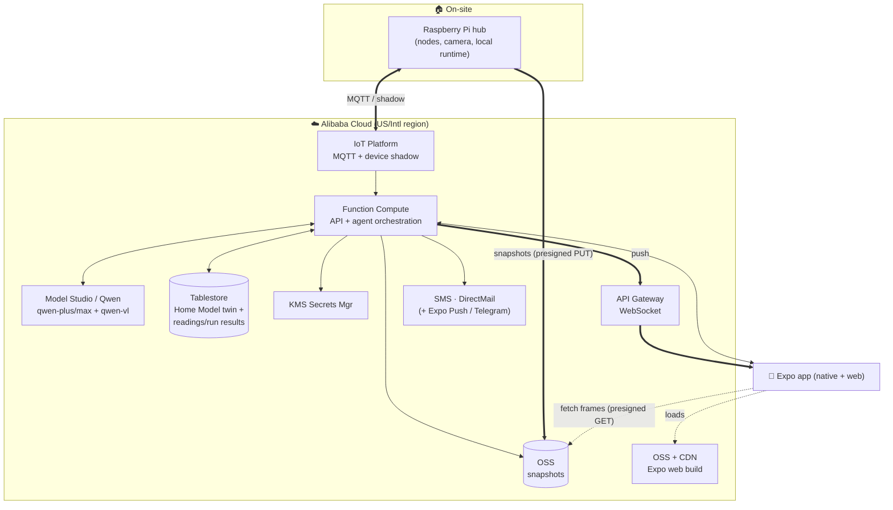

# 01 — Infra: Alibaba Cloud stack

> ⚠️ **Planning-time doc.** The table below is the **candidate** stack we researched up front.
> What we actually shipped is at the bottom (**"Decisions — how they actually resolved"**) and in
> the root `README.md`. Several candidates here were never built. Read the bottom first.

Maps each capability in `00-capabilities.md` to **candidate** Alibaba Cloud services. These are
research-backed proposals with alternatives + tradeoffs. Everything here is chosen to
be **scale-to-zero / cheap-at-idle** to survive the **$40 voucher**.

> **Standing principle: heavily favor Alibaba Cloud for every decision.** Breadth of *their*
> platform is worth judging points and reduces integration surface. Reach for an external
> service only when Alibaba has no reasonable equivalent (and say why).

> ⚠️ Account is **US-registered** → confirm whether we're on the **International**
> (`dashscope-intl.aliyuncs.com`) or **US/Virginia** (`dashscope-us.aliyuncs.com`) region and use
> the matching endpoints/consoles for *all* services. Verify exact free tiers/quotas at build time.

## Capability → candidate service

| # | Capability | Primary candidate | Alternative(s) | Scale-to-0? | Notes |
|---|---|---|---|---|---|
| C1 | Reasoning (text+vision) | **Model Studio / DashScope — Qwen** (`qwen-plus`/`qwen-max`, **`qwen-vl`**), OpenAI-compatible | Qwen-Omni (audio) | pay-per-token | Required tech. Endpoint per account region. |
| C2 | Backend compute | **Function Compute (FC)** — serverless, scales to zero | Serverless App Engine (SAE) | ✅ yes | New-user free tier: ~1M invocations + 400k CU-s/mo. No model hosting needed. |
| C3 | Home Model (twin) | **Tablestore** (serverless NoSQL, JSON) | ApsaraDB RDS/PolarDB **serverless** (SQL+JSONB) | ✅ (set reserved CU=0 → pay-per-request) | Document-shaped twin; low write volume. |
| C4 | Observation store | **Tablestore** time-series (same instance) | Lindorm (IoT TS), RDS | ✅ | Append-heavy readings + run results; query by device+time. |
| C5 | Snapshots (blobs) | **OSS** + **presigned URLs** | — | ✅ pay-per-use | App fetches frames directly via temp URLs → backend stays thin. Lifecycle rules for expiry. |
| C6 | Edge↔cloud sync | **IoT Platform** (MQTT + **device shadow** = offline-tolerant twin) | DIY WebSocket (API Gateway + FC) | ✅ pay-per-message; free 10 living devices/day | Shadow gives us the intermittent-link semantics for free. Adds setup. **Key decision — see §OD-1.** |
| C7 | Realtime → app | **API Gateway WebSocket API** (native, on by default) | IoT Platform MQTT-over-WS; short polling | ✅ pay-per-call | Push run answers/state to the app. |
| C8 | Secrets | **KMS Secrets Manager** (`GetSecretValue` at runtime, rotation) | env in FC (weaker) | small per-secret | Cloud tokens (chat/SMS/email). Hub-local secrets stay encrypted on the hub. |
| C9 | Notification channels | **SMS** (200+ countries) · **DirectMail** (email) · **Expo Push** (app) · Telegram (free) | Message Service (MNS) fan-out; Vonage (external) | pay-per-send | "All-on-Alibaba" = SMS+DirectMail; Expo Push is native to the app; Telegram = free demo garnish. |
| C10 | Web hosting (Expo web) | **OSS static hosting + CDN** | FC + API Gateway | ✅ | Judge-accessible URL. |
| C11 | Identity/access | **IDaaS (EIAM)** | DIY JWT in FC | ✅ | Or defer: single-home + guest-demo for v1 (see 00 OQ-3). |
| C12 | Observability | **SLS (Log Service)** | FC built-in logs | ✅ mostly | Also backs the decision/audit trail. |

## Candidate reference architecture

## Cost / scale-to-zero read (fits $40)
- **Idle ≈ $0:** FC (pay-per-invoke), OSS (pay-per-use), Tablestore (reserved CU=0 → pay-per-request), API Gateway (pay-per-call), IoT Platform (pay-per-message, 10 free devices/day), SMS/DirectMail (pay-per-send).
- **The real spend is Qwen tokens.** Our **question-compilation (local predicates) + interval Records** deliberately minimize Qwen-VL calls → the architecture is token-frugal *by design*, which is exactly what the $40 budget requires. Good story for judges, real necessity for us.
- **Watch:** Tablestore reserved throughput (keep at 0), IoT Platform **Pro** device-management fees (Basic if we don't need them), any always-on component (avoid ECS entirely).

## Judging leverage
Using **IoT Platform (shadow) + OSS + Tablestore + KMS + Qwen (VL + tool-calling)**, and exposing
the home as an **MCP server** the Qwen agent calls, directly targets the rubric's repeated
"**sophisticated use of Qwen Cloud APIs (custom skills, MCP integrations)**" and the mandatory
"**Proof of Alibaba Cloud Deployment**." Breadth of *their* stack = points.

## Decisions — how they actually resolved in the shipped code

> This doc was written at planning time. Below is what we **actually built**, which differs from
> the leans above in two places. The code is the truth.

- **OD-1 — Transport: ❌ NOT IoT Platform.** We planned IoT Platform + device shadow and **did not
  ship it** — no MQTT/IoT SDK is in the repo. We built the "rejected" option: a **DIY device shadow**
  (`store.setDesired()` in `backend/src/store.ts`, polled by the hub via `applyDesired` in
  `hub/hub.mjs`) plus a self-hosted WebSocket relay (`relay/relay.mjs`). Reason: Function Compute
  can't hold an open browser WebSocket, and the DIY shadow was a fraction of the setup cost. The
  shadow semantics are real; the Alibaba branding on them is not.
- **OD-2 — Store: ✅ Tablestore.** Shipped — `backend/src/tablestore.ts`; live health reports
  `store:"tablestore"`. Holds watches, accounts, OTP, hub pairings, device registry.
- **OD-3 — Realtime: ⚠️ self-hosted WebSocket relay, not API Gateway.** See OD-1. Note commit
  `c6848a5` is titled "via Alibaba API Gateway WebSocket" — the title is wrong; the code is a DIY
  relay. See `backend/docs/realtime-relay.md`.
- **OD-4 — Notifications: ntfy + Telegram** (not Alibaba SMS/DirectMail). OTP email goes via
  **ZeptoMail**, not DirectMail.
- **OD-5 — Auth: ✅ built** (accounts + OTP on Tablestore), not deferred, not IDaaS.
- **OD-6 — Compute: ✅ one FC app** (`hearth-mcp`), as leaned.

### Planned but NOT shipped (candidates only — no code exists)
**IoT Platform** · **KMS Secrets Manager** (secrets are FC env vars) · **SMS / DirectMail** ·
**API Gateway WebSocket** · **OSS static hosting + CDN** (the app is on Vercel) · **IDaaS** · **SLS**.

### Shipped Alibaba services
**Function Compute 3.0** · **Model Studio / DashScope (qwen-plus, qwen-vl-plus)** · **Tablestore** · **OSS**.

## Sources
- Function Compute (serverless, scale-to-zero, pricing): https://www.alibabacloud.com/en/product/function-compute/pricing · https://www.alibabacloud.com/help/en/functioncompute/fc/user-guide/introduction-to-serverless-gpus-1
- Qwen via Model Studio / DashScope (OpenAI-compat, Qwen-VL, endpoints): https://www.alibabacloud.com/help/en/model-studio/compatibility-of-openai-with-dashscope · https://www.alibabacloud.com/help/en/model-studio/qwen-vl-compatible-with-openai
- IoT Platform (device shadow, MQTT, pricing, 10 free devices/day): https://www.alibabacloud.com/help/en/iot/developer-reference/device-shadow · https://www.alibabacloud.com/product/iot/pricing
- Tablestore (serverless NoSQL, pay-as-you-go): https://www.alibabacloud.com/help/en/tablestore/what-are-billing-methods-and-items-of-tablestore
- API Gateway WebSocket: https://www.alibabacloud.com/help/en/api-gateway/cloud-native-api-gateway/user-guide/create-a-websocket-api
- OSS (presigned URLs, billing): https://www.alibabacloud.com/help/en/oss/user-guide/how-to-obtain-the-url-of-a-single-object-or-the-urls-of-multiple-objects · https://www.alibabacloud.com/help/en/oss/billing-overview
- KMS Secrets Manager: https://www.alibabacloud.com/help/en/kms/key-management-service/user-guide/secret-management-overview
- SMS / DirectMail: https://www.alibabacloud.com/help/en/sms/product-overview/what-is-alibaba-cloud-sms · https://www.alibabacloud.com/help/en/direct-mail/product-overview/directmail
