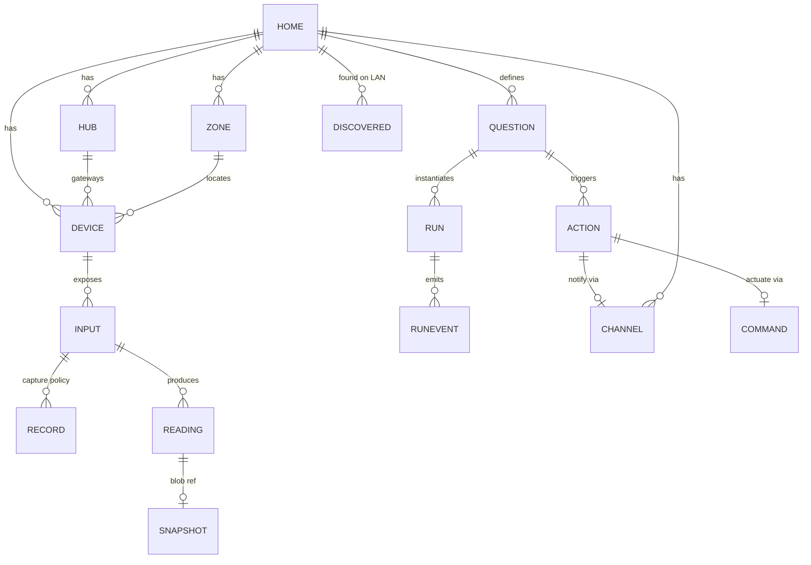
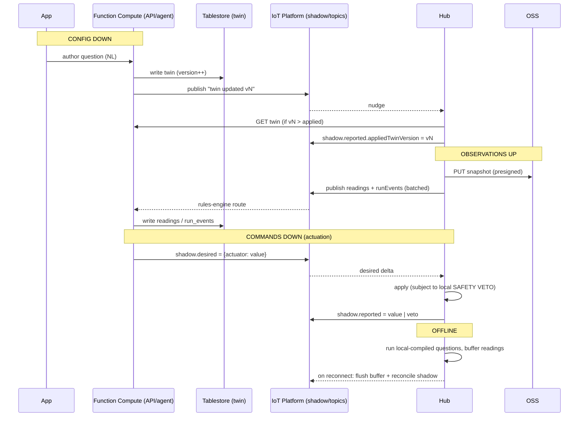

# 02 — Data Model (single source of truth)

The complete data model for Hearth, designed solutions-architect style: entities, schemas,
storage mapping, keys/TTL, and sync semantics. **Standing principle: heavily favor Alibaba Cloud.**
OD-1 is settled → transport is **Alibaba IoT Platform** (gateway + sub-devices + device shadow).

Notation is language-neutral TypeScript-ish interfaces + JSON examples. This is a *model*, not code.

---

## Design principles

1. **Type travels with the data.** Every datum is self-describing via a canonical `Type`, so the
   app and Qwen interpret any sensor without bespoke parsing.
2. **Config vs observation split.**
   - **Configuration** (the *Home Model twin*) — low-volume, authoritative, versioned.
   - **Observation** (readings, snapshots, run events) — high-volume, append-only, TTL'd.
3. **The twin is one versioned document per home.** This is the "source-of-truth object hosted in
   Alibaba Cloud" — small, cheap, optimistic-concurrency versioned.
4. **Live device state + offline reconcile = IoT Platform device shadow** (desired/reported).
   Large config is *pulled* by the hub; small live control goes through the shadow.
5. **Privacy by construction.** Raw blobs stay local unless a Record/Question needs them; identities
   (RFID) are hashed; only minimized, event-driven data is persisted to cloud.

---

## Entity overview



- **Configuration (the twin):** Home, Zone, Hub, Device, Input, Record, Question, Action, Channel.
- **Observation (high-volume):** Reading, Snapshot, RunEvent, Command.
- **Transient:** DiscoveredDevice.

---

## Canonical type system

`Type` is how a datum is interpreted. Shorthand id = `kind/unit` (e.g. `temperature/C`).

```ts
interface Type {
  kind: "temperature" | "humidity" | "distance" | "presence" | "switch"
      | "image" | "audio" | "rfid_uid" | "location" | "voltage" | "generic";
  dtype: "number" | "bool" | "enum" | "string" | "blob";
  unit?: string;          // "C", "%RH", "cm", "V" … (null for blobs)
  enum?: string[];        // for dtype "enum"
  range?: [number, number];
  mime?: string;          // blobs: "image/jpeg", "audio/wav"
  semantics?: string;     // human/LLM-readable meaning, e.g. "garage door open/closed"
}
```

Starter catalog: `temperature/C`, `humidity/%RH`, `distance/cm`, `presence/bool`, `switch/bool`,
`voltage/V`, `rfid_uid/string` (hashed), `location/geo`, `image/jpeg`, `audio/wav`.

---

## Configuration entities — the Home Model twin

Assembled into **one versioned document per home** (stored whole; also addressable per-entity via API).

```ts
interface Home {
  id: string;                 // "home_..."
  name: string;
  ownerId?: string;           // deferred; single-home + guest for v1
  createdAt: number;          // epoch ms UTC
  version: number;            // monotonic; optimistic concurrency
}

interface Zone { id: string; homeId: string; label: string; }

interface Hub {               // the Raspberry Pi — an IoT Platform GATEWAY device
  id: string;
  homeId: string;
  iot: { productKey: string; deviceName: string };   // IoT Platform identity
  status: "online" | "offline";
  lastSeen: number;
  fw?: string;
  appliedTwinVersion: number; // reported by hub via shadow (reconcile marker)
}

interface Device {            // an ESP node (IoT SUB-device) or a discovered/virtual device
  id: string;                 // "dev_..."
  homeId: string;
  hubId: string;
  zoneId?: string;
  kind: "hearth_node" | "third_party" | "virtual";   // virtual = simulator
  label: string;
  vendor?: string;            // from OUI/fingerprint or self-describe
  model?: string;
  transport: ("wifi" | "nrf24" | "usb" | "ip")[];
  iot?: { productKey: string; deviceName: string };   // sub-device identity (native nodes)
  status: "online" | "offline" | "discovered" | "ignored";
  lastSeen?: number;
  context?: DeviceContext;
  inputs: string[];           // inputIds
}

interface DeviceContext {     // powers the world model + semantic input resolution
  placementPhoto?: string;    // OSS key
  description?: string;       // Qwen-VL scene description or user text
  heading?: number;           // degrees, from phone compass
  location?: { lat: number; lon: number };   // coarse
}

interface Input {             // a typed datastream OR an actuator surface
  id: string;                 // "inp_..."
  deviceId: string;
  direction: "sensor" | "actuator";
  type: Type;
  defaultCadence?: string;    // Duration "5m","2s"
  writable?: boolean;         // actuators
  safety?: SafetyRule[];      // local veto constraints (enforced on the node)
}

interface SafetyRule {        // e.g. never open valve while leak latched
  when: string;               // predicate id / expression
  forbid: string;             // command/value forbidden
}

interface Record {            // configurable capture policy (interval snapshots etc.)
  id: string;                 // "rec_..."
  inputId: string;
  mode: "interval" | "on_event";
  interval?: string;          // Duration, e.g. "20s"
  retain: { count?: number; maxAge?: string };
  transform?: "raw" | "crop" | "downscale" | "redact";  // privacy/bandwidth
  active: boolean;
}

interface Channel {           // outbound notification connection (secret in KMS)
  id: string;                 // "chan_..."
  homeId: string;
  type: "expo_push" | "telegram" | "sms" | "email";
  config: Record<string, unknown>;   // non-secret (chatId, phone, email)
  secretRef: string;          // KMS Secrets Manager name for token/keys
}
```

### Question, compilation, Action (the agentic core)

```ts
interface Question {
  id: string;                 // "q_..."
  homeId: string;
  text: string;               // the natural-language intent
  boundInputs: string[];      // inputIds Qwen selected
  compiledTo: "local" | "cloud_reason" | "cloud_vl";
  compiledSpec: LocalPredicate | CloudCheck;
  evalOn: "record" | "interval" | "event";  // cadence source (usually a Record)
  actions: string[];          // actionIds fired when answer flips true
  authoredBy: "qwen" | "user";
  createdAt: number;
  version: number;
}

// Compiled to run OFFLINE on the hub — the cheap, local, no-LLM path
interface LocalPredicate { expr: PredicateNode; }
type PredicateNode =
  | { op: ">"|">="|"<"|"<="|"=="|"!="; left: InputRef; right: number|string|boolean }
  | { op: "and"|"or"; nodes: PredicateNode[] }
  | { op: "changed"|"delta"; input: InputRef; window: string; threshold?: number };
interface InputRef { input: string; agg: "latest"|"mean"|"min"|"max"; window?: string; }

// Compiled to call Qwen in Function Compute — the open-ended / vision path
interface CloudCheck {
  model: "qwen-plus" | "qwen-max" | "qwen-vl";
  promptTemplate: string;
  send: { inputs: string[]; snapshots?: string[] };  // context to include
  outputSchema: object;       // JSON Schema for a structured answer
  maxCadence: string;         // rate-limit cloud calls (protects the $40 budget)
}

interface Action {
  id: string;                 // "act_..."
  homeId: string;
  type: "actuate" | "notify";
  // actuate:
  target?: { deviceId: string; inputId: string };   // actuator input
  command?: unknown;                                 // desired value
  // notify:
  channelId?: string;
  message?: string;           // template; Qwen may fill the specifics
}
```

> **What shipped:** `Channel` is not a separate addressable entity. Channels are a single
> per-account record (`backend/src/notify.ts` → `NotifyConfig`: one Telegram chat + one email,
> set in the dashboard under *Notify me*) — which still satisfies `HOME ||--o{ CHANNEL` above,
> since a Home ≈ an account. So there is no `channelId` to reference: a notify Action carries
> only its `message`, and delivery fans out to whatever the homeowner turned on. Watches
> express this as `push: true` on a Question rather than a separate Action row.

**Authoring flow:** user NL intent → Qwen (in FC) reads the twin's device/input catalog →
emits a `Question` with `boundInputs`, `compiledTo`, `compiledSpec`, sensible `Record` cadence,
and `actions`. Qwen decides local-vs-cloud (§budget) — *admitting when the LLM isn't needed is a feature.*

---

## Observation entities — high-volume, append-only

```ts
interface Reading {           // one sample from an input
  homeId: string; deviceId: string; inputId: string;
  ts: number;                 // epoch ms UTC
  type: string;               // "temperature/C"
  value?: number | boolean | string;   // scalar
  blobRef?: string;           // OSS key for image/audio
  buffered?: boolean;         // replayed from the hub's offline buffer
}

interface Snapshot {          // index row for a blob capture (blob lives in OSS)
  homeId: string; deviceId: string; inputId: string;
  ts: number;
  ossKey: string;             // "snap/{homeId}/{deviceId}/{inputId}/{ts}.jpg"
  meta?: { w?: number; h?: number; mime: string; bytes?: number };
  expiresAt?: number;         // mirror of OSS lifecycle
}

interface RunEvent {          // an evaluation result — the timeline + audit trail
  runId: string; homeId: string;
  ts: number;
  answer: { match: boolean; value?: unknown; confidence?: number };
  reasoning?: string;         // Qwen rationale (why) — audit
  evaluatedBy: "hub_local" | "qwen-plus" | "qwen-max" | "qwen-vl";
  contextRefs?: { readings?: number[]; snapshots?: string[] };
  actionsFired: string[];     // actionIds
}

interface Run {
  id: string;                 // "run_..."
  questionId: string; homeId: string;
  state: "active" | "paused";
  startedAt: number; lastEvalAt?: number;
  lastAnswer?: RunEvent["answer"];
}

interface Command {           // an actuation, realized via the device shadow desired-state
  id: string;                 // "cmd_..."
  homeId: string; deviceId: string; inputId: string;
  desired: unknown;
  issuedBy: string;           // runId or "user"
  status: "queued" | "sent" | "applied" | "vetoed";
  vetoReason?: string;        // from the node's local safety veto
  ts: number;
}
```

## Transient — discovery

```ts
interface DiscoveredDevice {  // found on LAN, not yet connected (user must initiate)
  homeId: string;
  mac: string; vendor?: string;         // OUI lookup
  hostname?: string; ip?: string;
  services?: string[];                  // mDNS/SSDP service strings
  fingerprint?: Record<string, unknown>;
  suggestedType?: Type[];               // Qwen's guess from the fingerprint
  suggestedLabel?: string;
  status: "discovered" | "connected" | "ignored";
  seenAt: number;
}
```

---

## Storage mapping (favor Alibaba)

| Entity | Alibaba service | Key design | TTL / lifecycle |
|---|---|---|---|
| **Home Model twin** (Home+Zone+Hub+Device+Input+Record+Question+Action+Channel refs) | **Tablestore** table `home_model` | PK = `homeId` → one JSON doc, `version` attr | none (small, versioned) |
| Reading (scalars) | **Tablestore** `readings` | PK = `homeId#deviceId#inputId`, SK = `ts` | TTL from `Record.retain` |
| Snapshot blob | **OSS** | `snap/{homeId}/{deviceId}/{inputId}/{ts}.jpg` | OSS lifecycle rule (expiry) |
| Snapshot index | **Tablestore** `snapshots` | PK = `homeId#deviceId#inputId`, SK = `ts` | TTL |
| RunEvent | **Tablestore** `run_events` | PK = `homeId#runId`, SK = `ts` | TTL |
| Run (live) | **Tablestore** `runs` (or in twin) | PK = `homeId`, SK = `runId` | none |
| Command log | **Tablestore** `commands` + **IoT shadow** desired | PK = `homeId#deviceId`, SK = `ts` | TTL on log |
| Device/Hub live state (online, appliedTwinVersion, actuator reported) | **IoT Platform device shadow** | per gateway/sub-device | n/a |
| Channel secrets | **KMS Secrets Manager** | secret name in `Channel.secretRef` | rotation |
| DiscoveredDevice | **Tablestore** `discovered` | PK = `homeId`, SK = `mac` | short TTL |

Tablestore notes: keep **reserved CU = 0** (pay-per-request); add a **Search Index** only if the app
needs ad-hoc queries; use TTL for all observation tables to bound cost.

### As built — the run log (`hearth_runs`)

The shipped run log follows the shape above but not its keys, for the same reason the twin
landed as `hearth_home` rather than `home_model`: one account-scoped table per retention class,
PK `(account, sk)`. See `backend/src/store.ts`.

| | As built |
|---|---|
| Table | `hearth_runs`, `sk = <13-digit-padded-ms>#<id>` — time-ordered range scan; id breaks ms ties between concurrent FC instances |
| TTL | **365 days**, swept server-side (watches are forever, readings are 24h, spend history sits between) |
| Grain | a row per **billed call** (`authored`/`edited`/`judged`) and per **outcome** (`fired`/`held`/`actuate`/`notify`) |
| Cost | `model`, `tokens{in,out}`, `usd`, `ms` — **measured** from the model API's own `usage` block, priced with the same `MODEL_RATES` the quote uses |
| Search | `search_runs` (MCP) — time window, watch, kind, engine, free text, billed-only. Filtered in memory after a time-bounded scan; the **Search Index** above is still the escape hatch if that stops being enough |

Two invariants worth keeping:

- **`usd` is set iff the row IS the billed call.** A judged look that fires writes two rows from
  one Qwen call; pricing both would double the bill, and totals just sum `usd`.
- **Skips are counters, never rows** (`WatchRunState.skips`). A vision watch is evaluated on every
  frame and skipped cheaply by the cadence floor or local gate; a row each would be ~170k/day/watch
  and the audit would cost more than the Looks it audits. They are approximate by construction —
  nothing derived from money reads them.

Absent `usd` ≠ `usd: 0`: one means we never paid, the other means we paid nothing. Search has to
tell them apart, so unbilled rows carry no `usd` field at all.

---

## Sync & twin semantics (IoT Platform)

Hub = **gateway device**; each native node = **sub-device** under it.



- **Config down:** twin is authored in the cloud (Tablestore), version-bumped; hub pulls on nudge/boot and reports `appliedTwinVersion` via shadow → clean reconcile.
- **Observations up:** snapshots go **straight to OSS** via presigned PUT (thin backend); readings/run-events publish over IoT topics → rules engine → FC → Tablestore.
- **Commands down:** Actions set the sub-device **shadow desired**; the node applies subject to its **local safety veto** and reports back. Shadow reconciles if the node was offline.
- **Offline:** hub keeps running **local-compiled** questions + Records, buffers observations, and reconciles on reconnect. Cloud-compiled questions simply pause until the link returns.

---

## Conventions
- **IDs:** typed prefix + opaque suffix — `home_`, `dev_`, `inp_`, `rec_`, `q_`, `run_`, `act_`, `chan_`, `cmd_`.
- **Timestamps:** `ts` = epoch **milliseconds, UTC**.
- **Durations:** short strings — `"2s"`, `"20s"`, `"5m"`, `"1h"`.
- **Versioning:** `Home.version` monotonic; writes are compare-and-set; hub reports applied version.
- **Privacy:** `rfid_uid` values are **hashed** before persistence; GPS coarsened; blob `transform`
  (crop/redact) applied at the hub before upload.

## Open questions
1. Store `Run` inside the twin doc, or as its own table? (Lean: own table — runs churn; twin stays config-only.)
2. Do we need a Search Index on `readings` for the app timeline, or is a PK+time-range scan enough? (Lean: scan.)
3. Audio in v1? (Adds `audio/*` Types + OSS blobs + Qwen-Omni; lean v2.)
4. Multi-hub per home in v1? (Model supports it; demo likely single-hub.)
