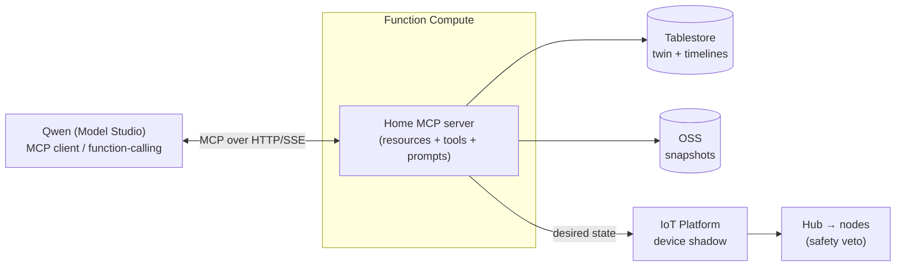
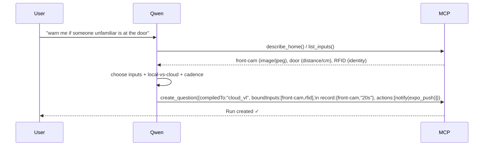
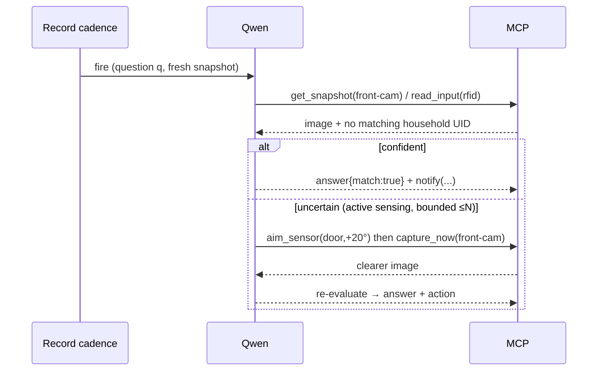

# 03 — Agent & MCP Surface

How Qwen reasons over the house and acts. The home is exposed as a **Home MCP server** the Qwen
agent connects to — one typed interface to perceive and effect. This is the deliberate
"**MCP integration / custom skills**" the rubric rewards. **Favor Alibaba:** the MCP server runs
in **Function Compute**, fronts **Tablestore** (twin), **OSS** (snapshots), and the hub via
**IoT Platform device shadow**; the agent is **Qwen** via Model Studio.

Depends on `02-data-model.md` (entities) — tools are typed operations over those entities.

---

## Two modes, one surface (and a third path with no agent at all)

| Mode | When | Agent does | LLM cost |
|---|---|---|---|
| **Authoring** | user writes a question / asks for suggestions | NL intent → a **compiled Question** (program synthesis) | one-shot, at design time |
| **Runtime** | a *cloud-compiled* question fires on its Record cadence | evaluate over fresh context, optionally **investigate**, decide actions | per eval, rate-limited |
| **Local (no agent)** | a *local-compiled* question | hub evaluates a predicate — **zero tools, zero LLM, offline** | none |

The local path is the majority and the point of question-compilation: the agent is invoked only
where open-ended reasoning is actually needed.

## Architecture



**Transport:** MCP over HTTP/SSE, hosted in FC. If Model Studio's MCP *client* support is limited,
the identical tool schemas are used via **Qwen function-calling** — so the catalog is
transport-agnostic (MCP is the target, function-calling the fallback).

## MCP primitives: resources vs tools vs prompts (idiomatic MCP)

- **Resources** (readable context, no side-effects): `home://model` (the twin/world-model),
  `home://inputs`, `home://readings/{inputId}`. The agent *reads* these to ground itself.
- **Tools** (effectful or computed operations): the catalog below.
- **Prompts** (server-provided templates): `authoring`, `runtime-eval`, `suggest-runs` — the
  reusable system prompts, versioned with the server.

## Tool catalog (composable primitives, not a bespoke sprawl)

Generality comes from typed inputs + composition. ~11 tools cover the house.

| Tool | Purpose | Availability |
|---|---|---|
| `describe_home()` | World-model summary (zones, devices, inputs, placements) | authoring, runtime |
| `list_inputs(filter?)` | Inputs with type + semantics | authoring |
| `read_input(inputId, agg?, window?)` | Latest/aggregated scalar reading | authoring, runtime |
| `query_history(inputId, from, to)` | Time-series slice (timeline) | authoring, runtime |
| `get_snapshot(inputId, at?)` | Fetch an image for Qwen-VL (OSS presigned) | authoring, runtime |
| `capture_now(inputId)` | Force a fresh snapshot — **active sensing** | runtime |
| `aim_sensor(deviceId, angle, reason)` | Move servo to look closer — **active sensing** | runtime |
| `actuate(inputId, value, reason)` | Command an actuator (→ shadow desired, veto-gated) | runtime |
| `notify(channelId, message)` | Send an Action via a channel | runtime |
| `set_record(inputId, policy)` | Create/adjust a capture policy | authoring |
| `create_question(spec)` | Persist a compiled Question | authoring |
| `suggest_runs()` | Propose useful questions from the world model | authoring |

**Runtime is deliberately constrained:** the runtime agent may *perceive* and *investigate*
(`read_*`, `get_snapshot`, `capture_now`, `aim_sensor`) but may only fire the **pre-authored
actions** of its Question — it decides *whether*, not *what*. Authoring holds the creative latitude
(`create_question`, `set_record`, `suggest_runs`); runtime cannot invent new effects. Predictable + safe.

### Representative schemas

```ts
// read
read_input(input: string, agg?: "latest"|"mean"|"min"|"max", window?: string)
  -> { ts: number, type: string, value: number|boolean|string }

get_snapshot(input: string, at?: number)
  -> { ossUrl: string, ts: number, mime: string }        // presigned; fed to Qwen-VL

// investigate (active sensing)
aim_sensor(deviceId: string, angle: number, reason: string) -> { ok: boolean }
capture_now(input: string) -> { ossUrl: string, ts: number }

// act (veto-gated, logged with rationale)
actuate(input: string, value: unknown, reason: string)
  -> { status: "sent"|"applied"|"vetoed", vetoReason?: string }
notify(channelId: string, message: string) -> { ok: boolean }

// author (program synthesis output)
create_question(spec: {
  text: string, boundInputs: string[],
  compiledTo: "local"|"cloud_reason"|"cloud_vl",
  compiledSpec: LocalPredicate | CloudCheck,
  evalOn: "record"|"interval"|"event",
  record?: { inputId: string, interval: string },
  actions: Action[]
}) -> { questionId: string }
```

---

## Authoring loop (NL intent → compiled Question)



**Local-vs-cloud decision policy (the agent applies at authoring):**
- Threshold/boolean over scalar inputs → **`local`** predicate (offline, no LLM).
- Needs image understanding → **`cloud_vl`**.
- Needs open-ended judgment/fusion over non-visual signals → **`cloud_reason`**.
- Always set the cheapest `maxCadence` that satisfies the intent (budget guard).

## Runtime loop (cloud-compiled eval + active sensing)



The **active-sensing loop is bounded** (max N investigate iterations) so it can't spin or burn
budget. This bounded "look closer when unsure" is the signature agentic behavior.

## Guardrails

- **Safety veto** — every `actuate` is a shadow *desired* the node may refuse; the tool returns
  `vetoed` + reason. The agent never bypasses local safety.
- **Constrained runtime action space** — runtime can only fire the Question's authored actions.
- **Budget** — `CloudCheck.maxCadence` rate-limits evals; active-sensing bounded to N; local
  questions cost nothing. All Qwen calls are logged as `RunEvent.reasoning` (audit + explainability).
- **Idempotency** — `actuate`/`notify` carry the `runId+ts` so repeats (retries, reconnect replays)
  don't double-fire.

## Tool → data-model mapping (ties to 02)

| Tool | Operation |
|---|---|
| `read_input` / `query_history` | read `Reading` (Tablestore) |
| `get_snapshot` / `capture_now` | `Snapshot` + OSS presigned GET (capture = request hub grab) |
| `aim_sensor` / `actuate` | write `Command` → IoT shadow *desired*; node reports *reported*/veto |
| `set_record` | upsert `Record` in the twin |
| `create_question` | upsert `Question` (+ compiledSpec) in the twin, version++ |
| `notify` | resolve `Channel` (+ KMS secret) → SMS/DirectMail/Expo/Telegram |
| `describe_home` / `list_inputs` | read the twin (`home://model`) |

## Open questions
1. MCP client support in Model Studio today, or function-calling fallback for v1? (Design is either.)
2. Does `capture_now` push a shadow request to the hub and await the frame (sync), or return the
   next Record frame (async)? (Lean: short-await with timeout → fall back to latest.)
3. Should `suggest_runs` run proactively on onboarding, or only on demand? (Lean: on onboarding — it's a hero beat.)
4. One MCP server, or split perception vs actuation servers? (Lean: one for v1.)
