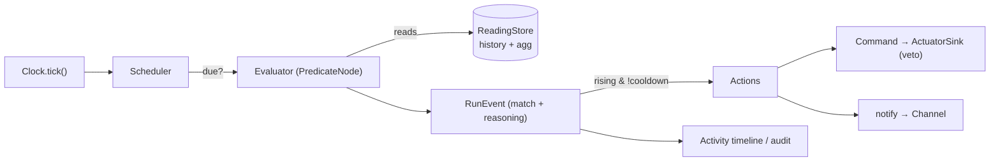

# 04 — Rule Engine (temporal, local-first evaluation)

How a compiled `Question` is actually *run over time* on the hub — the piece `02-data-model.md`
names (`LocalPredicate`, `Record`, `Run`, `RunEvent`, `Command`) but leaves unspecified. This is the
**local, no-LLM evaluation loop**: the majority path (`03:19`), the thing that keeps firing offline,
and the substrate the MCP read tools (`read_input`, `query_history`) sit on.

**Design stance:** this is not a new subsystem. The data model already carries windowed aggregation
(`InputRef.agg + window`), change/rate ops (`changed`/`delta`), and cadence (`Question.evalOn`,
`Run.lastEvalAt`). The engine *completes* that local evaluator by adding the two things it can't work
without — **a clock** and **reading history** — plus the one missing operator, **`sustained` (duration)**.
Everything else here is making the existing shapes runnable.

The browser demo is the **reference implementation** of this engine; the Raspberry Pi hub (Python)
implements the same interfaces against real time, real samples, and the IoT device shadow. Same
grammar, same evaluator, same `Run`/`RunEvent` audit — only the adapters differ (§Swap-points).

---

## Why the current demo mis-fires (the problem this closes)

"Garage open for **more than 5 minutes**" fires immediately because (a) the demo's ad-hoc condition
DSL has no duration operator, so "5 minutes" is dropped at authoring, and (b) nothing advances time
or re-evaluates on a cadence — a rule is only re-checked when an input *changes*. But "5 minutes
elapsed" becomes true with **no input change** — only the clock moved. Temporal rules therefore
require clock-driven evaluation over retained history. That is the whole of the fix.

---

## The three additions

1. **Clock** — a single `now()` source. Temporal truth is a function of time, so every eval reads
   the clock, never `Date.now()` inline. Demo = a *simulated* clock that ticks and can be sped up
   (so "5m" is watchable in seconds); hub = wall time.
2. **Reading history** — each `Input` keeps an append-only, `retain`-bounded buffer of
   `Reading{ts,value}`. This is exactly what `read_input(agg,window)` / `query_history` read (`03:63`),
   and what duration/trend predicates evaluate against.
3. **`sustained` + `schedule` + cadence evaluation** — adopt `PredicateNode` and add `sustained`
   (held-continuously-for) and `schedule` (real time-of-day/cron, replacing the toy day/night flag);
   a **scheduler** re-evaluates each armed `Run` when its `evalOn` cadence is due, emitting a `RunEvent`.

---

## Predicate grammar (extends `02` `PredicateNode`)

```ts
type Duration = string;                 // "2s" "5m" "1h"  (02 convention)
type Scalar = number | string | boolean;

interface InputRef {
  input: string;                        // inputId
  agg?: "latest" | "mean" | "min" | "max" | "count";   // default "latest"
  window?: Duration;                    // aggregation window, ending at now
}

type PredicateNode =
  | { op: ">" | ">=" | "<" | "<=" | "==" | "!="; left: InputRef; right: Scalar }
  | { op: "and" | "or"; nodes: PredicateNode[] }
  | { op: "not"; node: PredicateNode }
  | { op: "changed"; input: InputRef; window: Duration }               // 02: value moved in window
  | { op: "delta"; input: InputRef; window: Duration; threshold: number } // 02: Δ ≥ threshold
  | { op: "sustained"; node: PredicateNode; for: Duration }            // NEW: node true continuously ≥ for
  | { op: "schedule"; window: TimeWindow };                            // NEW: wall-clock window

type TimeWindow =
  | { after?: "HH:MM"; before?: "HH:MM"; days?: (0|1|2|3|4|5|6)[] }    // local time-of-day / weekdays
  | { cron: string };
```

**Firing modifiers** live on the `Question`/`Run`, not the predicate (they govern *when an answer
becomes an action*, not *what is true*):

```ts
interface FirePolicy {
  edge: "rising" | "level";   // default "rising": fire on false→true. "level": each due eval while true.
  cooldown?: Duration;        // min time between fires (debounce / anti-flap)
}
```

`Question` gains `evalOn` (already in `02`) and `fire: FirePolicy`; `sustained`/`schedule`/`delta`
imply `evalOn:"interval"` (must be re-checked as time passes) — the compiler sets this.

---

## Evaluation semantics

- **Level vs edge.** The predicate yields a *level* (true/false now). The `FirePolicy` turns level
  into events: `rising` fires once per false→true crossing (the default; an alert shouldn't re-nag);
  `cooldown` suppresses re-fires within a window.
- **`sustained(node, for)`** is derived from history: let `trueSince` = the timestamp of the most
  recent false→true transition of `node` with no false since (found from the reading buffer / prior
  eval state). Then `sustained` is true iff `trueSince != null && now - trueSince ≥ for`. Because
  this can flip true with no new reading, its `Run` must be on an **interval** cadence ≤ the smallest
  `for` it uses. The engine carries a small `Run.evalState` (e.g. cached `trueSince`) so this is O(1)
  per tick and survives restarts (re-derivable from history).
- **`agg`/`changed`/`delta`** read the buffer over `window` ending at `now`.
- **Cadence.** The scheduler advances the clock and, each tick, re-evaluates every active `Run` whose
  `evalOn` says it's due: `event` → on a relevant reading append; `interval` → when
  `now - lastEvalAt ≥ cadence`; `record` → when its bound `Record` samples. Local predicates eval for
  free; `CloudCheck` evals are additionally rate-limited by `maxCadence` (budget guard, `02:192`).
- **Local vs cloud is unchanged** (`03:126`): threshold/temporal over scalars → `LocalPredicate`
  (offline, no tokens, every tick); image/open-ended → `CloudCheck` (Qwen). A local `sustained`
  gate can *precede* a cloud check (cheap precondition before an expensive call).

---

## Actuation: latching Commands (not auto-revert)

Actions issue `Command`s (`02:252`) with **desired state that latches** until explicitly changed —
they are not tied to the predicate staying true. Consequences:

- An alert fired for "open > 5m" does **not** un-fire when you close the door; it's a delivered event.
- `actuate` latches: "turn on the heater" stays on. A **timed** action (`Action.duration`, e.g.
  "on for 10 min") schedules a paired follow-up command to revert — modeled as a future command, not
  as condition-coupling.
- Commands are veto-gated at the node (`Command.status: applied|vetoed`, `03:154`) and idempotent by
  `runId+ts` (`03:162`) so reconnect replays don't double-fire.
- The demo keeps a **reset** control and adds per-watch **snooze/clear**; it no longer silently
  reverts actuators when a trigger clears.

---

## Engine interfaces (the swap-points)

```ts
interface Clock { now(): number; }                              // ms UTC

interface ReadingStore {
  append(inputId: string, r: Reading): void;
  latest(inputId: string): Reading | null;
  history(inputId: string, from: number, to: number): Reading[];
  agg(inputId: string, agg: InputRef["agg"], window: Duration, now: number): Scalar | null;
}

interface ActuatorSink {                                        // returns veto result
  command(cmd: Command): { status: "sent" | "applied" | "vetoed"; vetoReason?: string };
}

interface Evaluator {                                           // pure over ReadingStore + Clock
  eval(node: PredicateNode, run: Run, now: number): { value: boolean; trueSince?: number };
}

interface Scheduler {                                           // ticks the world forward
  tick(now: number): RunEvent[];   // re-evals due Runs, fires actions, returns audit events
}
```

| Interface | Demo (browser) | Hub (Raspberry Pi) |
|---|---|---|
| `Clock` | simulated, ticking, speed-controlled | wall clock |
| `ReadingStore` | in-memory ring buffer | local buffer → Tablestore `readings` on sync |
| `ActuatorSink` | mutate sim state | IoT shadow `desired`, node applies + safety veto |
| reading source | poked world / `Record` sampler | real sensors / `Record` sampler |
| `Evaluator`, `Scheduler`, grammar, `Run`/`RunEvent` | **identical** | **identical** |



---

## Mapping to `02` / `03`

| This doc | Entity / tool | Note |
|---|---|---|
| reading buffer | `Reading` + `Record.retain` | ring bounded by count/maxAge |
| `PredicateNode` (+`sustained`,`schedule`) | `LocalPredicate.expr` | superset of `02:180` |
| scheduler cadence | `Question.evalOn` + `Run.lastEvalAt` | interval for temporal ops |
| eval result | `RunEvent{answer,reasoning,evaluatedBy}` | the timeline / audit |
| latched action | `Command` (shadow desired, veto) | idempotent by `runId+ts` |
| `read_input(agg,window)` / `query_history` | MCP read tools (`03:63`) | thin reads over `ReadingStore` |
| local-vs-cloud gate | `compiledTo` + `CloudCheck.maxCadence` | budget discipline |

---

## Demo refactor map (adopting the real shapes)

| File | Change |
|---|---|
| `demo/types.ts` | replace `Deployment`/`Condition` with `Input`,`Reading`,`Record`,`Question`,`PredicateNode`,`Run`,`RunEvent`,`Command`,`Action` (from `02`). `Deployment`→`Question`; `Condition`→`PredicateNode`. |
| `demo/home.ts` | `NODES` → `Device`s exposing typed `Input`s; seed initial `Reading`s; `readCapability` reads `latest` from the store. |
| `demo/engine/*` (new) | `clock.ts`, `store.ts` (`ReadingStore`), `predicate.ts` (`Evaluator`, incl. `sustained`), `scheduler.ts`, `actuator.ts` (`ActuatorSink`). |
| `demo/brain/*` | author emits `Question{compiledTo,compiledSpec,evalOn,record,fire,actions}`; prompts gain the temporal ops; `/qwen` route validates the compiled spec (inputs exist, ops/types/windows valid) with a **reflect-and-repair** retry. |
| `demo/use-simulation.ts` | owns `Clock`+`Scheduler`; pokes append `Reading`s; scheduler drives evals → `RunEvent`s → activity; actions latch. |
| UI | TopBar: time control (play / speed / jump + live clock); tiles/floor-plan read latest readings; feed renders `RunEvent`s; add per-watch snooze/clear. |

---

## First slice (the vertical cut to prove it)

Clock + `ReadingStore` + `Evaluator` with `sustained/for` + `Scheduler` + `Run`/`RunEvent` + latched
`Command`, wired so **"alert me if the garage is open for more than N minutes"** works end-to-end:

1. Author → `Question{ compiledTo:"local", evalOn:"interval", fire:{edge:"rising"},
   compiledSpec:{ expr:{ op:"sustained", for:"5m", node:{ op:"==", left:{input:"garage.door"}, right:"open" } } } }`.
2. Open the door → the buffer records the transition; the answer is **false** (0 < 5m elapsed).
3. Fast-forward the clock; at +5 sim-min the scheduler's eval flips the answer **true** → one `RunEvent`
   → the notify Action fires (once; cooldown suppresses repeats).
4. Close the door before 5m → `trueSince` resets, never fires. Correct.

Then iterate: `schedule`, `delta`/trend, `cooldown`/snooze, timed actuation, and gating a `CloudCheck`
behind a local `sustained` precondition.

---

## A note on simulated time (honesty)

The demo runs a **simulated, speed-adjustable clock** so durations are demoable (a 5-minute rule fires
in ~5s at 60×). This is stated in the UI. It changes *nothing* about the logic — the hub runs the same
evaluator on wall time. Day/night stops being a toggle and becomes a real `schedule` over the sim clock.

---

## Open questions

1. `sustained` eval state: re-derive `trueSince` from history each tick (stateless, restart-safe) vs
   cache on `Run.evalState` (O(1), needs reconcile on restart)? *Lean: cache + derive-on-cold-start.*
2. Default interval cadence for temporal `Run`s — fixed (e.g. `1s` sim) vs `min(for)/K`? *Lean: `min(for)/10`, floor 1s.*
3. Do timed actions (`Action.duration`) belong on `Action` or as a distinct scheduled `Command`?
   *Lean: `Action.duration` sugar that the engine expands into a follow-up command.*
4. Should the demo expose `read_input`/`query_history` as real callable tools now (proves the MCP
   substrate), or keep them internal until the MCP server exists? *Lean: internal now, expose with `03`.*
```
